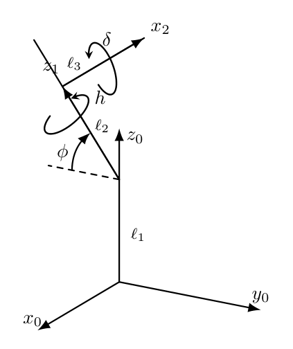

# Telescope Pointing

To determine how much of the telescope's aperture is obstructed by the dome, the need to calculate the position of the telescope and the pointing direction in the frame local to the dome.

For the former, we use formalism from the robotics community, such as described in Chapters 2-4 of the book [*Robotics* (Mihelj, et al. 2018)](https://doi.org/10.1007/978-3-319-72911-4), which we use to express the apertures in the telescope-dome frame.

## Position of the telescope's aperture

The image below shows the axes of the telescope mount at the centre of the dome, along with the rotation directions of the right ascension and declination axes. Here $z_0$ is pointing to zenith and $z_1$ to the north celestial pole (NCP) and the $y$-axis indicates the front of the mount.

The goal is to describe the position of the aperture in the frame of the dome. Thus, the initial frame is a frame whose origin is the floor of the dome, where the telescope mount is connected to the building. To translate the frame from the floor to the origin of the right ascension (RA) axis, we perform a translation along the $z$-axis, which is represented by the transformation matrix ${}^0\text{H}_1$:

$$
{}^0\text{H}_1 =
\begin{bmatrix}
    1 & 0 & 0 & 0\\
    0 & 1 & 0 & 0\\
    0 & 0 & 1 & \ell_1\\
    0 & 0 & 0 & 1
\end{bmatrix}
$$

Then ${}^1\text{H}_2$ brings us to the frame that intersects the RA axis with the declination axis, which is inclined, such that it points to the north celestial pole. This frame rotates along the $z$-axis with the hour angle and has a translation to the intersection, such that the transformation matrix reads:
$$
{}^1\text{H}_2=\text{Rot}(x,\pi/2-\phi)\,\text{Rot}(z,-h)\,\text{Trans}(0,0,\ell_2)=
\begin{bmatrix}
    1 & 0 & 0 & 0\\
    0 & s_\phi & -c_\phi & 0\\
    0 & c_\phi & s_\phi & 0\\
    0 & 0 & 0 & 1
\end{bmatrix}
\begin{bmatrix}
    c_h & -s_h & 0 & 0\\
    s_h & c_h & 0 & 0\\
    0 & 0 & 1 & 0\\
    0 & 0 & 0 & 1
\end{bmatrix}
\begin{bmatrix}
    1 & 0 & 0 & 0\\
    0 & 1 & 0 & 0\\
    0 & 0 & 1 & \ell_2\\
    0 & 0 & 0 & 1
\end{bmatrix}
$$

The final transformation yields the position inside the primary aperture of the telescope, which we obtain by rotating along the $x$-axis (the declination axis) and a displacement to the centre of the optical axis:

$$
{}^2\text{H}_3=\text{Rot}(x,\delta)\,\text{Trans}(-\ell_3,0,0)=
\begin{bmatrix}
    1 & 0 & 0 & 0\\
    0 & c_\delta & -s_\delta & 0\\
    0 & s_\delta & c_\delta & 0\\
    0 & 0 & 0 & 1
\end{bmatrix}
\begin{bmatrix}
    1 & 0 & 0 & -\ell_3\\
    0 & 1 & 0 & 0\\
    0 & 0 & 1 & 0\\
    0 & 0 & 0 & 1
\end{bmatrix}
$$

Thus, to obtain the position of the telescope's primary aperture in the dome frame, we use the transformation matrix

$${}^0\text{H}_3={}^0\text{H}_1\, {}^1\text{H}_2\, {}^2\text{H}_3\$$

## Aperture Direction Vector

We can find the direction the telescope (aperture) is pointing in by taking the difference between two points on the telescope's optical axis in the frame of the dome, i.e. the origin frame.

Consider, for instance, the points:

$$\mathbf{r}_t(0)={}^0\text{H}_3\, \mathbf{r}_0$$

and

$$\mathbf{r}_{t}(y)={}^0\text{H}_4(y)\, \mathbf{r}_0$$

noting that the second point is variable and depends on $y$. Then we can define the direction (a unit vector) as,

$$\hat{\mathbf{d}}=\frac{\mathbf{d}}{||\mathbf{d}||}$$

where $\mathbf{d}=\mathbf{r}_t(y)-\mathbf{r}_t(0)$.

## Extension to the autoguider and finderscope

The application has been developed with the design of the Gratama telescope at the Blaauw Observatory in Groningen in mind, which also has an autoguider and finderscope, as shown in the figure below; this is a 3D model of the telescope. Assuming that your setup is somewhat similar, MOCCA can be tailored to your needs.

MOCCA assumes by default that the autoguider is situated at 45 degrees from the primary aperture and the centre of its aperture is displaced by a distance $\ell_4$, though both this angle and displacement are [configurable](../config.md).

$$
{}^3\text{H}_4=\text{Rot}(y,\pi/4)\,\text{Trans}(0,0,\ell_4)=
\begin{bmatrix}
\tfrac{1}{2}\sqrt{2} & 0 & \tfrac{1}{2}\sqrt{2} & 0\\
0 & 1 & 0 & 0\\
-\tfrac{1}{2}\sqrt{2} & 0 & \tfrac{1}{2}\sqrt{2} & 0\\
0 & 0 & 0 & 1
\end{bmatrix}
\begin{bmatrix}
    1 & 0 & 0 & 0\\
    0 & 1 & 0 & 0\\
    0 & 0 & 1 & \ell_4\\
    0 & 0 & 0 & 1
\end{bmatrix}
$$

Similarly, MOCCA assumes that the finderscope is located at an angle of 90 degrees from the axis connecting the autoguider and the primary aperture, such that we only require a final translation along the $x$-axis:

$$
{}^4\text{H}_5=\text{Trans}(-\ell_5,0,0)=
\begin{bmatrix}
    1 & 0 & 0 & -\ell_5\\
    0 & 1 & 0 & 0\\
    0 & 0 & 1 & 0\\
    0 & 0 & 0 & 1
\end{bmatrix}
$$
