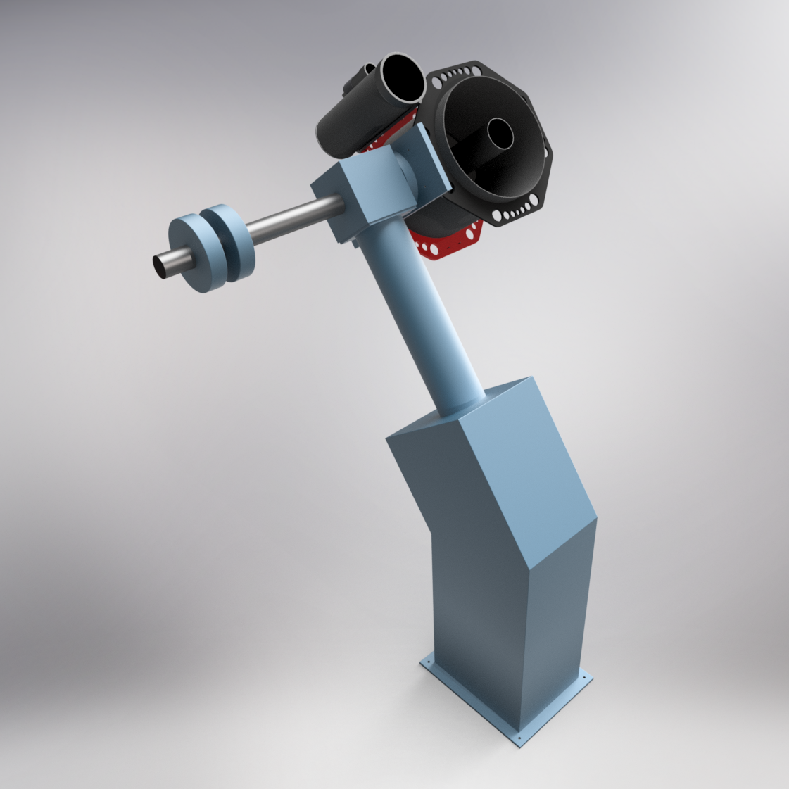
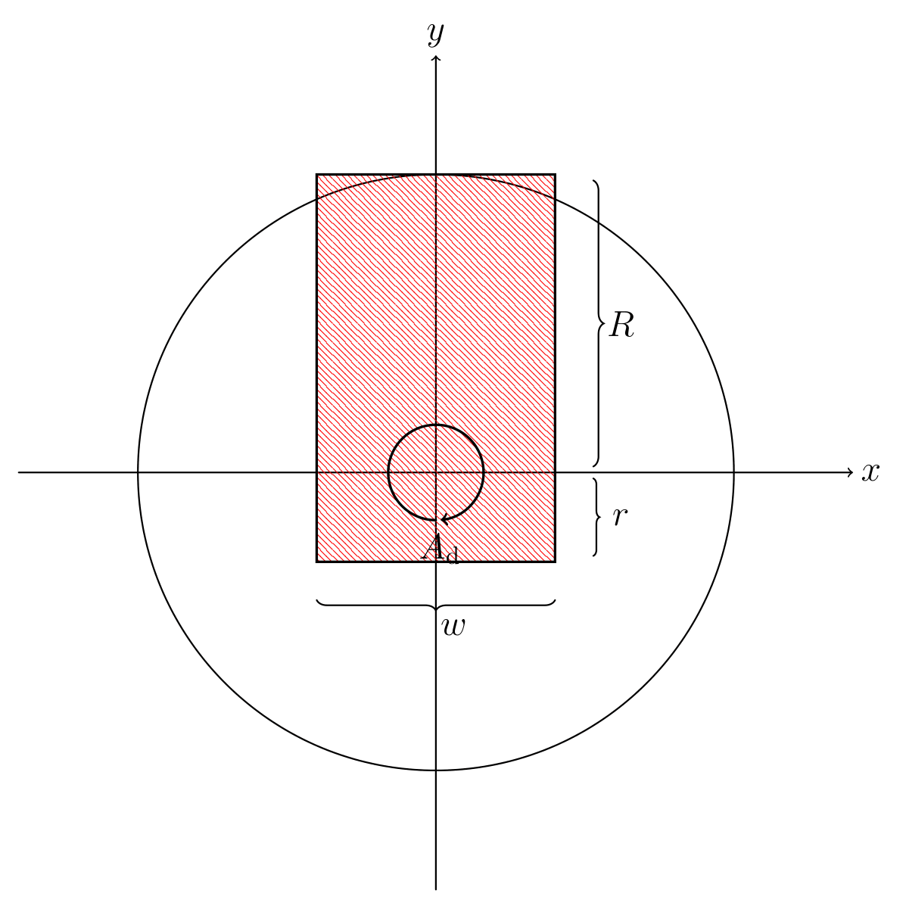

# Quantifying aperture obstruction

To quantify aperture obstruction, we need two (or rather three) pieces of information:

1. The location of the telescope aperture and its pointing direction in the dome frame.
1. The location of the dome's opening.

## Telescope pointing

The first two pieces of information are determined by the geometry of the telescope and its pointing, controlled by the hour angle ($h$) and declination ($\delta$); they can be determined using a set of transformation matrices.

The transformation matrices used by MOCCA are derived in Chapter 3 of [Mick Veldhuis (2021), Remodeling Dome Control: Applications for the Blaauw Observatory.](https://fse.studenttheses.ub.rug.nl/id/eprint/25172) for a telescope mounted to an equatorial mount, as schematically shown in the model of the Gratama telescope shown below.

## The dome

To model a hemispherical dome with position angle or azimuth $A_d$, we consider the geometry from a top-down vie, as shown in the figure below. In this figure, we highlight the opening (or slit) using red dashed lines in a black box with width $w$ and length $R+r$, where $R$ is the radius of the hemispherical dome and $r$ is the length of the part of the slit that extends past zenith.

## Obstruction conditions

To quantify aperture obstruction, we model the aperture as a circular collection of rays and find the intersection of these rays with the dome. From the position of these intersections in the dome-frame depicted above, we can infer whether a ray, or rather a part of the aperture, is blocked or not.

Considering the dome in the $xy$-plane, we can infer that a ray with intersection $\mathbf{p}(t)$ is **not** blocked when:

- the component of $\mathbf{p}(t)$ along the $x$-axis satisfies $-w/2<p_x(t)<w/2$,
- and the component of $\mathbf{p}(t)$ along the $y$-axis satisfies $-r<p_y(t)<R$.

Note that $t$ here is a measure of the distance from the origin of the aperture to where it intersects with the dome modeled as the upper half of a capsule, i.e. a cylinder with a hemispherical cap.
