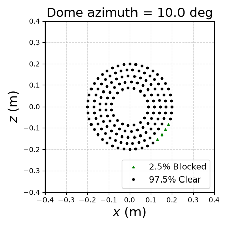

# General usage

MOCCA is a command line utility and accepts a few arguments that we will explain in this document. It calculates the percentage of the telescope aperture that is blocked by the surrounding dome, given the telescope pointing and the orientation of the dome.

Here's an example:

```bash
$ mocca --ha 10 --dec 90 --az 10
```

This uses the default configuration of the Blaauw Observatory and calculates the obstruction of the main telescope aperture when it's pointing with an hour angle of 10 degrees, a declination of 90 degrees and the dome is rotated by 10 degrees with respect to its zero-point.

A custom configuration can be provided as follows:

```bash
$ mocca --ha 10 --dec 90 --az 10 --config custom.toml
```

To configure the properties of the telescope and dome, MOCCA provides a TOML file (`mocca.toml`) the first time the user runs MOCCA without providing any custom configuration file; this file is written to the current working directory. The default values in this file are based on the properties of the Blaauw Observatory and can be modified by the user. For more information about this configuration file and the available properties, refer to the following document: [Configuring MOCCA](config.md).

The tool is specifically developed for telescope setups with a dedicated autoguider and finderscope, thus, we provide configuration options and the ability to select one of these apertures on the command line. For example, to calculate the obstruction of the autoguider, we can add the `--aperture` or `-a` option:

```bash
$ mocca --ha 10 --dec 90 --az 10 --aperture guider
```

MOCCA uses ray-tracing to calculate the obstruction and simulates each aperture as a collection of points from which the rays emmanate. The number of rays used in the calculation can be increased for increased accuracy, though at the cost of of performance. In particular, users can modify the number of rings in the circular aperture using the `--rate` or `-r` option:

```bash
$ mocca --ha 10 --dec 90 --az 10 --rate 5 --visualise
```

In this example, we simulate the aperture using five rings of rays and visualise the aperture by plotting all the points and highlighting the blocked rays, as shown in the image below. Note that we take into account blockage of aperture by the secondary mirror.



It's worth noting that the `--visualise` option spawns a window with the diagnostic plot, hence, won't work on a headless system.
